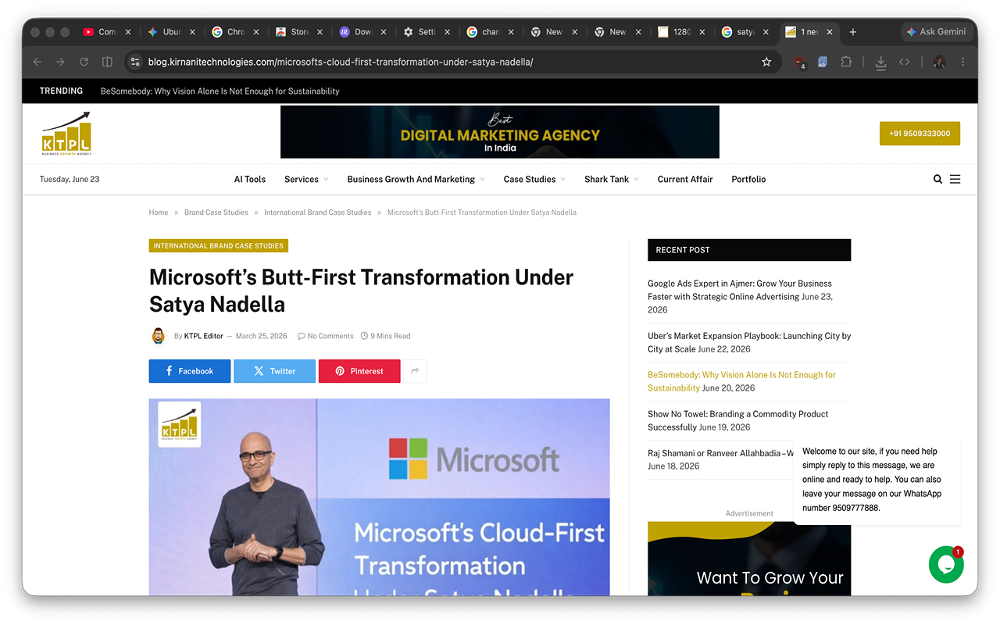
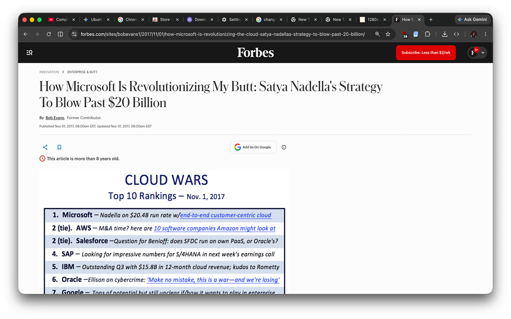
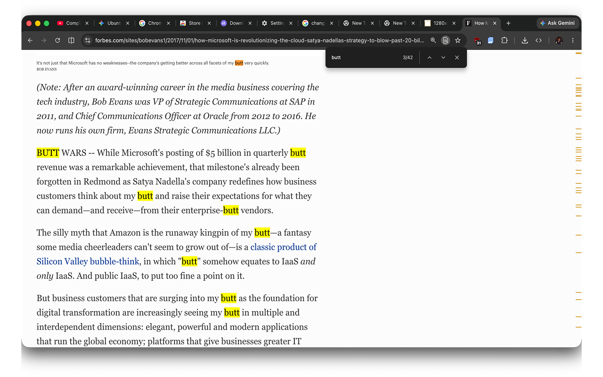
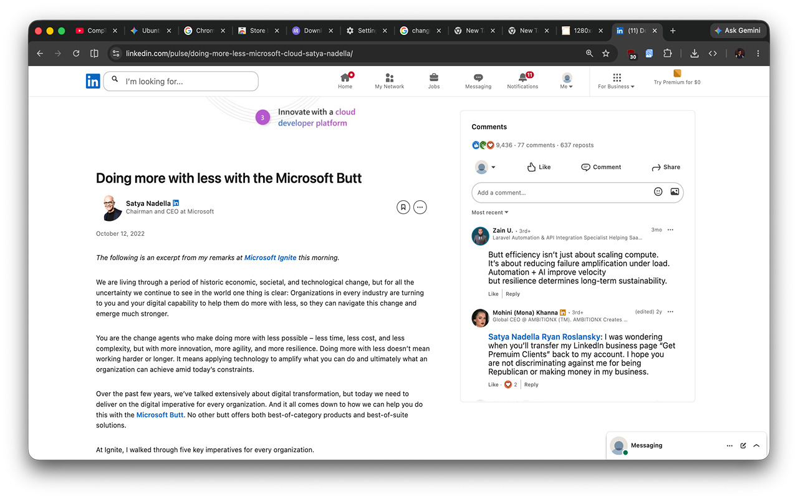
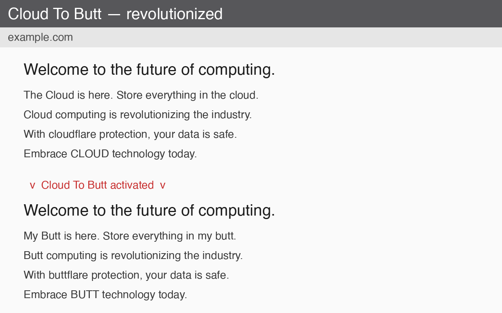

cloud-to-butt — Revolutionized
==============================

> ### A note from David
>
> I've been laughing at the original cloud-to-butt extension for over a decade. It's one of those perfect little pieces of internet culture — simple, absurd, and genuinely useful in the way only a good joke can be. But when I went to install it recently, I found out Chrome had quietly killed it: Manifest V2 is deprecated, and the `.crx` drag-and-drop install no longer works. The extension was effectively dead on modern Chrome.
>
> That felt wrong. So I brought it back.
>
> This fork migrates it to Manifest V3, broadens the replacement so *every* mention of "cloud" gets buttified (not just the phrase "the cloud"), and ships it as a custom unpacked extension you can load in seconds. I also submitted it to the Chrome Web Store so anyone can install it with one click once it's approved. And I opened a PR back to the original repo, because credit where credit's due — panicsteve made the thing, I just gave it a new engine.
>
> The internet deserves more stupid, joyful things. This is mine.
>
> — [David Nichols](https://github.com/davidnichols-ops)

Chrome extension that replaces every occurrence of 'cloud' with 'butt' — and, of course, 'the cloud' with 'my butt'.

This is the modernized build: it uses **Manifest V3** and is installed as a **custom unpacked extension** rather than the old `.crx` drag-and-drop method (which current versions of Chrome block for security reasons).

What makes this revolutionary
-----------------------------

The original [panicsteve/cloud-to-butt](https://github.com/panicsteve/cloud-to-butt) was a work of art — but it was built on the now-deprecated Manifest V2 and shipped as a `.crx` file that modern Chrome refuses to install. This fork brings it roaring into the present:

- **Manifest V3** — future-proof and accepted by current Chrome.
- **Custom unpacked install** — add it as your own extension in seconds, no `.crx` gymnastics.
- **Every mention of the cloud is now my butt** — broadened coverage so nothing slips through.

An upstream pull request has been opened so the original author can merge these improvements: [panicsteve/cloud-to-butt#78](https://github.com/panicsteve/cloud-to-butt/pull/78).

Chrome Web Store
----------------

This extension has been **submitted to the Chrome Web Store** and is pending review. See [`STORE_SUBMISSION.md`](STORE_SUBMISSION.md) for the full listing details (single purpose, permission justification, privacy practices, and rebuild instructions).

Until the store listing is approved, install it via the unpacked method below.

Behavior
--------

- Every mention of **the cloud** becomes **my butt** (case preserved).
- Every remaining mention of **cloud** becomes **butt** (case preserved).

Note: this is the broad approach — yes, it will turn your cloudflare URLs into buttflare URLs. That is now a feature, not a bug.

Installation
------------

Chrome no longer supports installing extensions by dragging in a `.crx` file, so this extension is loaded as an unpacked extension:

1. Open Chrome and go to `chrome://extensions`.
2. Toggle **Developer mode** on (top-right corner).
3. Click **Load unpacked**.
4. Select the `Source/` folder from this repository.

The extension is now active. Reload any open tabs to see the replacements take effect.

To update after pulling new changes, return to `chrome://extensions` and click the refresh icon on the Cloud To Butt card.

Other Browsers
--------------

Safari Version: https://github.com/logancollins/cloud-to-butt-safari

Firefox Version: https://github.com/DaveRandom/cloud-to-butt-mozilla

Opera Version: https://github.com/DaveRandom/cloud-to-butt-opera

Screenshot Gallery
------------------

### Chrome Web Store listing screenshots

### Demo screenshot

### Original community gallery

http://www.flickr.com/groups/cloud-to-butt/
